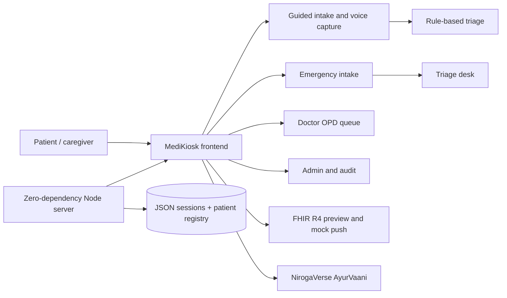

# AarogyaVaani · MediKiosk v2

AI-assisted patient case-taking platform for AYUSH and government OPDs.
Problem statement **SIH26047 — Patient Case-Taking Software**, Ministry of Ayush / All India Institute of Ayurveda.

## Presentation Snapshot

### The problem

Government and AYUSH outpatient departments often collect patient history manually. This creates long queues, incomplete records, language barriers, and missed triage signals.

### Our solution

**AarogyaVaani MediKiosk** is a multilingual, voice-enabled patient intake system that converts a patient's story into a structured, physician-reviewable case history.

It helps the patient speak comfortably, helps staff capture consistent information, and helps the doctor focus on clinical decisions instead of repetitive data entry.

### Why it stands out

- **Patient-first:** six Indian languages, touch-friendly screens, speech input and read-aloud support.
- **Clinically structured:** demographics, vitals, SOCRATES history, Dashavidha Pariksha and document capture.
- **Safety-aware:** deterministic red-flag rules for symptoms and vitals; no automated diagnosis or prescription.
- **Doctor-ready:** queue, triage priority, structured summary, OCR confidence, physician edits and FHIR preview.
- **Operationally practical:** works on low-spec kiosk hardware, saves intake live to the JSON backend, and includes a zero-dependency REST API.
- **Emergency-ready:** patient-started emergency intake lands on the triage desk as a priority case, never in a doctor’s personal OPD list.
- **Ayurveda-enabled:** the full NirogaVerse AyurVaani experience opens inside the MediKiosk AyurVaani tab.

### Demonstration flow

1. Patient opens the kiosk, picks a language, and (if needed) taps the side **Emergency** rail instead of regular OPD intake.
2. Regular path: identity (ABHA / Aadhaar / phone / new), demographics, consent, vitals, complaint, history, department, documents, review.
3. Every field is saved to the backend session as the patient types; it is not only kept in the browser.
4. Documents can be captured on the kiosk camera, Bluetooth, or a phone QR upload page.
5. Rule-based red flags still interrupt for staff; self-declared emergencies go to the **triage desk**, not the doctor OPD queue.
6. Doctor reviews the structured case, edits the draft and confirms it to the EMR/FHIR workflow.
7. The AyurVaani tab opens NirogaVerse inside the kiosk (kiosk LIVE bar is hidden there so it does not fight AyurVaani’s own chat).

### Suggested presentation line

> AarogyaVaani turns a multilingual patient conversation into a safe, structured and doctor-ready OPD record, without replacing the physician.

### Architecture



### Technology stack

| Layer | Technology |
| --- | --- |
| Frontend | Plain HTML, CSS and JavaScript |
| Server | Node.js zero-dependency HTTP server |
| Persistence | JSON file store with localStorage client persistence |
| Interoperability | FHIR R4 bundle preview and mocked ABDM/HIS push |
| Documents | Kiosk camera, Bluetooth, phone QR upload, OCR with confidence review |
| Voice | Web Speech API LIVE assistant on the kiosk (off on AyurVaani) |
| Ayurveda AI | NirogaVerse AyurVaani embedded consultation UI |

### Demo links

| Link | Purpose |
| --- | --- |
| `/?demo=1` | Preloaded patient case |
| `/?demo=1#/doctor` | Doctor queue |
| `/?demo=1#/triage` | Triage desk (emergency cases + kiosk red-flags) |
| `/?demo=1#/admin` | Consent, audit and FHIR view |
| `/?demo=1#/ayur` | Embedded NirogaVerse AyurVaani |

### Safety and scope

- The system structures patient-reported information; it does not diagnose or prescribe.
- Red flags are prioritisation signals and always show the evidence that triggered them.
- Every case remains preliminary until a physician confirms it.
- Consent is granular, timestamped and auditable.
- OCR values expose confidence scores so clinicians can verify uncertain extraction.

## Quick Start (Run it)

To run the application locally on any laptop:

```bash
# 1. Start the server (runs on port 4173 by default)
npm run dev

# (Optional) If port 4173 is busy, run it on port 5000:
PORT=5000 npm run dev
```

No install and no build step needed for the kiosk itself — plain HTML, CSS and JavaScript so it runs on low-spec kiosk hardware.

### AyurVaani AI tab (optional NirogaVerse backend)

**Note:** The NirogaVerse AyurVaani frontend client is **already pre-built** and saved in this repository. The AyurVaani tab will load instantly and use deterministic offline Ayurvedic guidance by default.

For the live AI consultation chat (Express + Prisma + OpenAI over the Charaka Samhita RAG), you need to build the NirogaVerse server backend once:

```bash
npm run build      # installs deps, generates the Prisma client, builds NirogaVerse server + client
npm start          # now also launches the NirogaVerse backend on :3000
```

- Kiosk: `http://localhost:4173` · AyurVaani embed served at `/niro/modules/ayurvaani`.
- The kiosk logs the embed in with its service account (`kiosk@aiia.gov.in`); set `NIRO_BASE` to point at a backend running elsewhere.
- `RUN_NIRO_SERVICE=false npm start` runs the kiosk without the NirogaVerse child process.
- The NirogaVerse server needs `OPENAI_API_KEY` for live answers (see `nirogaverse/README.md`); without a reachable backend the tab falls back to offline guidance automatically.

### Troubleshooting

- **Port already in use** — start on another port with `PORT=4180 npm run dev` (or kill the old process: `lsof -tiTCP:4173 | xargs kill`).
- **AyurVaani tab shows "Not found"** — a stale pre-v2.2 server is still running on that port; restart it with the current `server.mjs`, and make sure `nirogaverse/client/dist` exists (`npm run build`).
- After changing kiosk files, just refresh the browser — there is no frontend build step.

## What's new in v2.4 — emergency, live save, scan, branding

- **Emergency rail** — on every kiosk step a side **EMERGENCY** control lets the patient start intake themselves: name, problem, optional attendant (name / 10-digit contact / relationship). **Send to Triage** posts `POST /api/emergency` with `destination: "triage"`. The live kiosk session is **not** added to the doctor OPD queue.
- **Triage desk cards** — staff see `EMERGENCY CASE #n`, patient, problem, attendant (masked phone), status, then **Accept / Call patient / Open case** (`PATCH /api/emergency/:id`).
- **Live backend persist** — typing on the kiosk creates or patches `PATCH /api/session/:id` (patient, vitals, answers, AYUSH, consents, docs metadata, login, emergency draft). Identifiers (phone / ABHA / Aadhaar) also upsert the patient registry. Runtime store files stay gitignored.
- **Phone QR documents** — kiosk generates a QR to `scan-link.html`; the phone uploads photos to the same session.
- **AyurVaani isolation** — the floating LIVE command bar is hidden on the AyurVaani tab so only AyurVaani’s own composer/mic runs.
- **Official lockup** — header, sidebar, landing hero, favicon and scan-link use `assets/logo.jpg`.

## What's new in v2

| Area | v1 | v2 |
| --- | --- | --- |
| Patient identity | ABHA only | Full demographics: name, age, DOB, gender, blood group, marital status, occupation, education |
| Contact | none | Mobile, alternate number, address, city, state, PIN, area type, emergency contact + relationship, accompanying person |
| Vitals | none | BP, pulse, SpO₂, temperature, respiratory rate, height, weight, auto-calculated BMI, "read from device" simulation |
| Languages | 3 | 6 (Hindi, English, Marathi, Bengali, Tamil, Telugu) with speech synthesis read-aloud |
| Interview | 7 fixed questions | Complaint router with 9 complaint paths + 8 shared history blocks, SOCRATES slots, multi-select, 0–10 severity scale, free text, back navigation, progress rail |
| AYUSH | none | Full Dashavidha Pariksha (Prakriti, Vikriti, Sara, Samhanana, Pramana, Satmya, Sattva, Ahara Shakti, Vyayama Shakti, Vaya) plus Agni, Koshtha, Nidana |
| Red flags | 1 hard-coded | 9 deterministic rules across symptoms **and** vitals (SpO₂ < 92, systolic < 90, temp ≥ 103) |
| Doctor console | queue + summary | Queue with search, triage sort and vitals column; detail view with demographic card, vitals strip, source-tagged sections, accept/edit/reject, document OCR confidence, visit timeline, physician note, confirm-to-EMR |
| Triage desk | static | Emergency cases to triage staff + live red-flag alerts, acknowledgement flow |
| Admin | FHIR JSON | Consent ledger, append-only audit trail, language mix, retention policy, live FHIR R4 bundle with Patient / Encounter / Composition / Observation / Consent / Flag |
| UI | single stylesheet | New design system: 8px spacing scale, WCAG-AA teal palette, 44px+ tap targets, responsive down to 360px, print stylesheet, toasts, reduced-motion support |
| State | in-memory | localStorage persistence, deep links, demo preload, optional REST sync |

## Deep links (useful for demos)

| URL | Shows |
| --- | --- |
| `/` | Patient kiosk from the language screen |
| `/?demo=1` | Kiosk preloaded with the Ramesh Kumar chest-pain case |
| `/?demo=1#/doctor` | Doctor queue with the live patient at the top |
| `/?demo=1#/doctor/detail` | Full structured history for the live patient |
| `/?demo=1#/triage` | Triage desk (OTP `1234`) with emergency cases + red-flag alerts |
| `/?demo=1#/admin` | Consent ledger, audit trail and FHIR bundle |
| `/?demo=1#/ayur` | Ayurveda AI chat preloaded with the kiosk patient |
| `/?fresh=1` | Ignore saved session and start clean |

## Files

| File | Purpose |
| --- | --- |
| `index.html` | Shell |
| `styles.css` | Design system and all screens |
| `data.js` | Languages, i18n copy, demographics schema, complaint routers, Dashavidha ontology, red-flag rules, seed queue |
| `DESIGN.md` | Persisted design system: color tokens with WCAG AA contrast table, typography, spacing, touch targets, icons, motion |
| `views.js` | Pure render functions for every screen |
| `main.js` | State, validation, clinical logic, FHIR builder, event handling, ASR/OCR pipelines, API sync |
| `server.mjs` | Zero-dependency static server + REST API (JSON-file store) |
| `scan-link.html` / `phone-scan.html` | Patient-phone document upload opened from the kiosk QR |
| `assets/logo.jpg` | Official AarogyaVaani MediKiosk lockup |
| `combined-start.mjs` | `npm start` entrypoint: launches the NirogaVerse backend (when built) + the kiosk server |
| `.env` | NVIDIA / OpenAI / OpenRouter keys — never committed |
| `data/api-store.json` | Runtime sessions, emergencies, documents (gitignored) |
| `data/patients.json` | Runtime patient registry (gitignored) |

## Backend API (zero-dependency, JSON-file store)

Implemented per the SIH26047 implementation document. Same origin as the kiosk; the client syncs sessions, consents, turns, summaries and FHIR pushes to it automatically (fail-silent when offline). Intake fields are patched into the session as the patient types.

| Method & route | Purpose |
| --- | --- |
| `POST /api/auth/login` | ABHA/Aadhaar/phone + mock OTP (`1234`) → token |
| `POST /api/patients/lookup` | Returning-patient registry lookup |
| `POST /api/patients/upsert` | Merge demographics (visit row only when the case is submitted) |
| `POST /api/consent` | Record granular consent |
| `POST /api/session/start` | Create intake session (full snapshot) |
| `GET /api/session/:sessionId` | Fetch saved intake |
| `PATCH /api/session/:sessionId` | Live-save patient, vitals, answers, AYUSH, consents, docs |
| `POST /api/conversation/turn` | Store one interview turn |
| `POST /api/scan-link` | Create kiosk↔phone QR pairing |
| `POST /api/documents/upload` | Upload image for OCR |
| `GET /api/documents` | List documents for a session |
| `GET /api/documents/:id/status` | Poll OCR/extraction status |
| `POST /api/emergency` | Create triage-desk emergency case (not OPD queue) |
| `GET /api/emergency` | List emergency cases |
| `PATCH /api/emergency/:id` | Accept / open a triage case |
| `POST /api/summary/generate` | Generate structured summary |
| `GET /api/summary/:sessionId` | Fetch summary |
| `PATCH /api/summary/:sessionId` | Physician edits/confirms |
| `POST /api/fhir/push` | Mocked ABDM/HIS push (logged) |
| `GET /api/admin/analytics` | OPD load, kiosk time, complaints, language mix |
| `GET /api/dashboard` | Live landing/dashboard aggregates |
| `POST /api/ai/chat` | Doctor DocBot (OpenRouter → NVIDIA → OpenAI; keys stay in `.env`) |
| `POST /api/ai/command` | Kiosk LIVE voice commands |

## What's new in v2.3 — staff verification + doctor AI assistant (NVIDIA NIM)

- **Staff OTP login gate** — the Doctor console, Triage desk and Admin views are now restricted to verified staff: name + staff ID → OTP (demo `1234`) → verified session with a staff chip and logout in the top bar. Patient kiosk stays untouched.
- **Gemini-style DocBot panel** — a "DocBot" button on the doctor console slides in a side panel with a gradient "Find information" welcome, suggestion chips and a rounded ask box. It automatically attaches the open patient's structured context (demographics, vitals, SOCRATES history, red flags, Dashavidha Pariksha) to every question.
- **NVIDIA NIM backend** — `POST /api/ai/chat` proxies to `mistralai/mistral-nemotron` (fallback `nvidia/nemotron-3-super-120b-a12b`) with a clinical system prompt. The key lives only in `.env` (gitignored); requests rotate model pools with jittered retries, and an offline structured checklist answers when NVIDIA is unreachable so the demo never stalls.
- **Safety preserved** — the assistant supports the physician only; it never issues final diagnoses or prescriptions, matching the MediKiosk safety model.

## What's new in v2.2 — Ayurveda AI (NirogaVerse bridge)

- **"Ayurveda AI" tab** — a full AyurVaani consultation chat inside the kiosk, powered by the [NirogaVerse](https://github.com/) backend (Express + Prisma + OpenAI over the Charaka Samhita RAG).
- **Same-origin proxy** — `server.mjs` forwards `/api/niro/*` to the NirogaVerse API (`/api/auth/*`, `/api/niro/*`), handling JWT login (with automatic first-run registration of the kiosk service account) so there is no CORS setup. Point it at the backend with `NIRO_BASE=http://localhost:3000`.
- **Kiosk → AI handoff** — one tap on the completion screen (or inside the chat) sends the patient's structured history — demographics, vitals, chief complaint, Prakriti/Agni/Koshtha — as the opening consultation message.
- **Offline fallback** — when NirogaVerse is unreachable, the kiosk degrades gracefully to a deterministic Ayurvedic assessment (Prakriti-based pathya/dinacharya rules) so the demo never stalls; status pill shows "Offline guidance".
- **Voice + read-aloud** — Web Speech API input and text-to-speech output, Hindi/English, matching the rest of the kiosk.

## What's new in v2.1 (implementation-document parity)

- **ABHA OTP login** — mock OTP `1234` on the identity step; production note points to ABDM OAuth2.
- **Real voice input** — Web Speech API (6 Indian languages) with an offline simulation fallback.
- **Document upload + OCR** — Tesseract.js in-browser (CDN) with progress spinner, structured field extraction, editable review; falls back to simulated extraction offline.
- **REST API + analytics** — the 11 endpoints above; admin charts for daily OPD load and top complaints now reflect real sessions.

## Safety model

- The system **never diagnoses and never prescribes**. It only structures what the patient says.
- Red flags are deterministic rules, labelled as prioritisation signals, and always shown with the evidence that triggered them.
- Every summary stays a `preliminary` FHIR Composition until a physician confirms it.
- Granular consent (5 toggles, improvement-data off by default), timestamped in an append-only audit trail, DPDP Act 2023 aligned.
- Every extracted document value carries an OCR confidence score; anything under 85% is flagged for physician verification.
