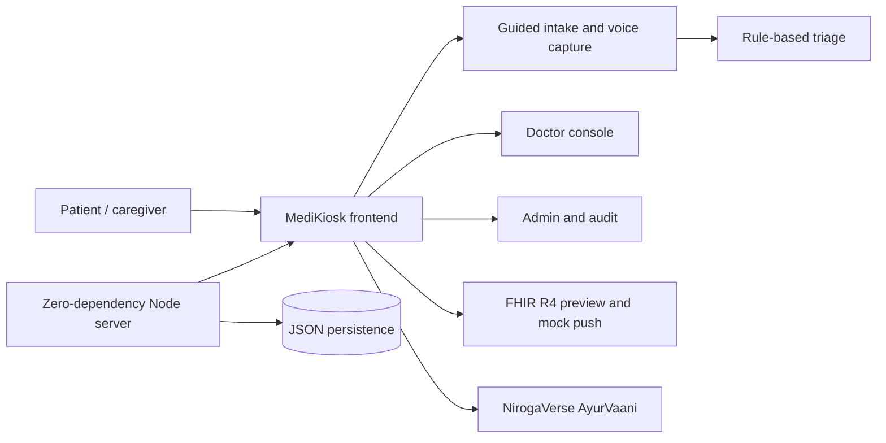

# AarogyaVaani · MediKiosk v2

AI-assisted patient case-taking platform for AYUSH and government OPDs.
Problem statement **SIH26047 — Patient Case-Taking Software**, Ministry of Ayush / All India Institute of Ayurveda.

## Presentation Snapshot

### The problem

Government and AYUSH outpatient departments often collect patient history manually. This creates long queues, incomplete records, language barriers, and missed triage signals.

### Our solution

**AarogyaVaani MediKiosk** is a multilingual, voice-enabled patient intake system that converts a patient's story into a structured, physician-reviewable case history.

It helps the patient speak comfortably, helps staff capture consistent information, and helps the doctor focus on clinical decisions instead of repetitive data entry.

### Why it stands out

- **Patient-first:** six Indian languages, touch-friendly screens, speech input and read-aloud support.
- **Clinically structured:** demographics, vitals, SOCRATES history, Dashavidha Pariksha and document capture.
- **Safety-aware:** deterministic red-flag rules for symptoms and vitals; no automated diagnosis or prescription.
- **Doctor-ready:** queue, triage priority, structured summary, OCR confidence, physician edits and FHIR preview.
- **Operationally practical:** works on low-spec kiosk hardware, persists locally, and includes a zero-dependency REST API.
- **Ayurveda-enabled:** the full NirogaVerse AyurVaani experience opens inside the MediKiosk AyurVaani tab.

### Demonstration flow

1. Patient selects a preferred language.
2. Kiosk captures identity, demographics, contact, consent and department.
3. Staff records vitals or simulates device reading.
4. Patient describes the complaint using guided questions, voice or free text.
5. The system collects medical history, AYUSH assessment and documents.
6. Rule-based triage highlights urgent signals for staff review.
7. Doctor reviews the structured case, edits the draft and confirms it to the EMR/FHIR workflow.
8. The AyurVaani tab opens the original NirogaVerse consultation UI inside the kiosk.

### Suggested presentation line

> AarogyaVaani turns a multilingual patient conversation into a safe, structured and doctor-ready OPD record, without replacing the physician.

### Architecture



### Technology stack

| Layer | Technology |
| --- | --- |
| Frontend | Plain HTML, CSS and JavaScript |
| Server | Node.js zero-dependency HTTP server |
| Persistence | JSON file store with localStorage client persistence |
| Interoperability | FHIR R4 bundle preview and mocked ABDM/HIS push |
| Documents | In-browser OCR pipeline with confidence review |
| Voice | Web Speech API with offline simulation fallback |
| Ayurveda AI | NirogaVerse AyurVaani embedded consultation UI |

### Demo links

| Link | Purpose |
| --- | --- |
| `/?demo=1` | Preloaded patient case |
| `/?demo=1#/doctor` | Doctor queue |
| `/?demo=1#/triage` | Live triage alerts |
| `/?demo=1#/admin` | Consent, audit and FHIR view |
| `/?demo=1#/ayur` | Embedded NirogaVerse AyurVaani |

### Safety and scope

- The system structures patient-reported information; it does not diagnose or prescribe.
- Red flags are prioritisation signals and always show the evidence that triggered them.
- Every case remains preliminary until a physician confirms it.
- Consent is granular, timestamped and auditable.
- OCR values expose confidence scores so clinicians can verify uncertain extraction.

## Run it

```bash
npm start          # serves on http://localhost:4173
```

No build step, no dependencies. Plain HTML, CSS and JavaScript so it runs on low-spec kiosk hardware.

## What's new in v2

| Area | v1 | v2 |
| --- | --- | --- |
| Patient identity | ABHA only | Full demographics: name, age, DOB, gender, blood group, marital status, occupation, education |
| Contact | none | Mobile, alternate number, address, city, state, PIN, area type, emergency contact + relationship, accompanying person |
| Vitals | none | BP, pulse, SpO₂, temperature, respiratory rate, height, weight, auto-calculated BMI, "read from device" simulation |
| Languages | 3 | 6 (Hindi, English, Marathi, Bengali, Tamil, Telugu) with speech synthesis read-aloud |
| Interview | 7 fixed questions | Complaint router with 9 complaint paths + 8 shared history blocks, SOCRATES slots, multi-select, 0–10 severity scale, free text, back navigation, progress rail |
| AYUSH | none | Full Dashavidha Pariksha (Prakriti, Vikriti, Sara, Samhanana, Pramana, Satmya, Sattva, Ahara Shakti, Vyayama Shakti, Vaya) plus Agni, Koshtha, Nidana |
| Red flags | 1 hard-coded | 9 deterministic rules across symptoms **and** vitals (SpO₂ < 92, systolic < 90, temp ≥ 103) |
| Doctor console | queue + summary | Queue with search, triage sort and vitals column; detail view with demographic card, vitals strip, source-tagged sections, accept/edit/reject, document OCR confidence, visit timeline, physician note, confirm-to-EMR |
| Triage desk | static | Live alerts driven by the same rule engine, acknowledgement flow |
| Admin | FHIR JSON | Consent ledger, append-only audit trail, language mix, retention policy, live FHIR R4 bundle with Patient / Encounter / Composition / Observation / Consent / Flag |
| UI | single stylesheet | New design system: 8px spacing scale, WCAG-AA teal palette, 44px+ tap targets, responsive down to 360px, print stylesheet, toasts, reduced-motion support |
| State | in-memory | localStorage persistence, deep links, demo preload, optional REST sync |

## Deep links (useful for demos)

| URL | Shows |
| --- | --- |
| `/` | Patient kiosk from the language screen |
| `/?demo=1` | Kiosk preloaded with the Ramesh Kumar chest-pain case |
| `/?demo=1#/doctor` | Doctor queue with the live patient at the top |
| `/?demo=1#/doctor/detail` | Full structured history for the live patient |
| `/?demo=1#/triage` | Triage desk with the open alert |
| `/?demo=1#/admin` | Consent ledger, audit trail and FHIR bundle |
| `/?demo=1#/ayur` | Ayurveda AI chat preloaded with the kiosk patient |
| `/?fresh=1` | Ignore saved session and start clean |

## Files

| File | Purpose |
| --- | --- |
| `index.html` | Shell |
| `styles.css` | Design system and all screens |
| `data.js` | Languages, i18n copy, demographics schema, complaint routers, Dashavidha ontology, red-flag rules, seed queue |
| `DESIGN.md` | Persisted design system: color tokens with WCAG AA contrast table, typography, spacing, touch targets, icons, motion |
| `views.js` | Pure render functions for every screen |
| `main.js` | State, validation, clinical logic, FHIR builder, event handling, ASR/OCR pipelines, API sync |
| `server.mjs` | Zero-dependency static server + REST API (JSON-file store) |
| `data/api-store.json` | API persistence (created at runtime — stands in for Postgres + Mongo) |

## Backend API (zero-dependency, JSON-file store)

Implemented per the SIH26047 implementation document. Same origin as the kiosk; the client syncs sessions, consents, turns, summaries and FHIR pushes to it automatically (fail-silent when offline).

| Method & route | Purpose |
| --- | --- |
| `POST /api/auth/login` | ABHA/Aadhaar + mock OTP (`1234`) → token |
| `POST /api/consent` | Record granular consent |
| `POST /api/session/start` | Create intake session |
| `POST /api/conversation/turn` | Store one interview turn |
| `POST /api/documents/upload` | Upload image for OCR |
| `GET /api/documents/:id/status` | Poll OCR/extraction status |
| `POST /api/summary/generate` | Generate structured summary |
| `GET /api/summary/:sessionId` | Fetch summary |
| `PATCH /api/summary/:sessionId` | Physician edits/confirms |
| `POST /api/fhir/push` | Mocked ABDM/HIS push (logged) |
| `GET /api/admin/analytics` | OPD load, kiosk time, complaints, language mix |

## What's new in v2.2 — Ayurveda AI (NirogaVerse bridge)

- **"Ayurveda AI" tab** — a full AyurVaani consultation chat inside the kiosk, powered by the [NirogaVerse](https://github.com/) backend (Express + Prisma + OpenAI over the Charaka Samhita RAG).
- **Same-origin proxy** — `server.mjs` forwards `/api/niro/*` to the NirogaVerse API (`/api/auth/*`, `/api/niro/*`), handling JWT login (with automatic first-run registration of the kiosk service account) so there is no CORS setup. Point it at the backend with `NIRO_BASE=http://localhost:3000`.
- **Kiosk → AI handoff** — one tap on the completion screen (or inside the chat) sends the patient's structured history — demographics, vitals, chief complaint, Prakriti/Agni/Koshtha — as the opening consultation message.
- **Offline fallback** — when NirogaVerse is unreachable, the kiosk degrades gracefully to a deterministic Ayurvedic assessment (Prakriti-based pathya/dinacharya rules) so the demo never stalls; status pill shows "Offline guidance".
- **Voice + read-aloud** — Web Speech API input and text-to-speech output, Hindi/English, matching the rest of the kiosk.

## What's new in v2.1 (implementation-document parity)

- **ABHA OTP login** — mock OTP `1234` on the identity step; production note points to ABDM OAuth2.
- **Real voice input** — Web Speech API (6 Indian languages) with an offline simulation fallback.
- **Document upload + OCR** — Tesseract.js in-browser (CDN) with progress spinner, structured field extraction, editable review; falls back to simulated extraction offline.
- **REST API + analytics** — the 11 endpoints above; admin charts for daily OPD load and top complaints now reflect real sessions.

## Safety model

- The system **never diagnoses and never prescribes**. It only structures what the patient says.
- Red flags are deterministic rules, labelled as prioritisation signals, and always shown with the evidence that triggered them.
- Every summary stays a `preliminary` FHIR Composition until a physician confirms it.
- Granular consent (5 toggles, improvement-data off by default), timestamped in an append-only audit trail, DPDP Act 2023 aligned.
- Every extracted document value carries an OCR confidence score; anything under 85% is flagged for physician verification.
